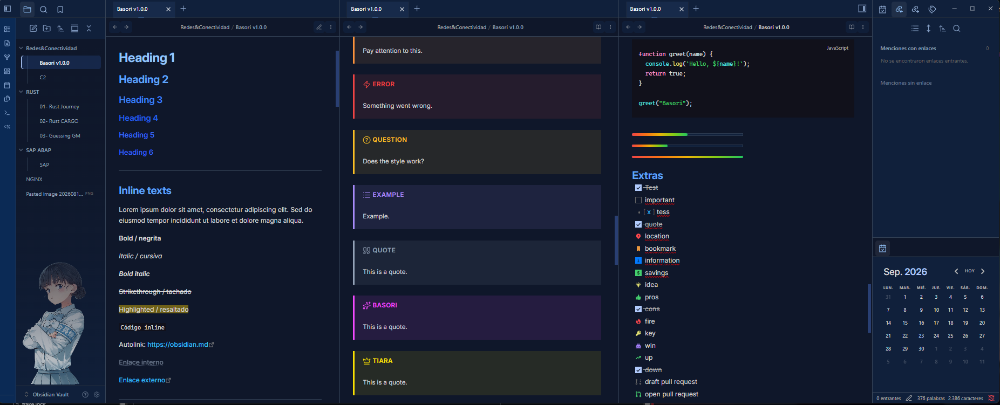
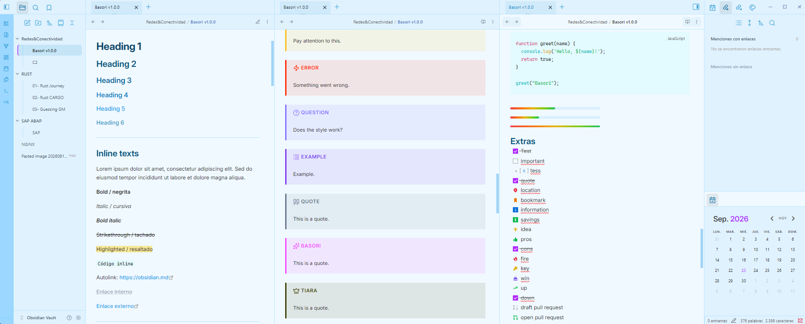
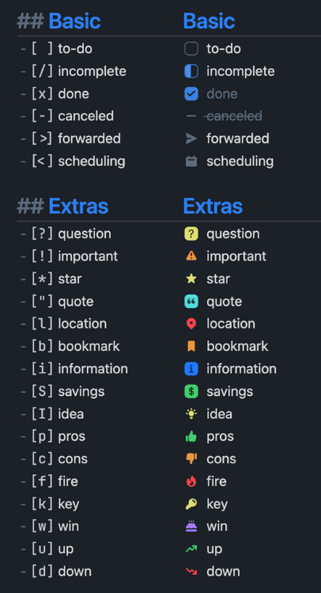

# Basori

> An Obsidian theme inspired by **Basori Tiara** — clean lines, cool blues, and a sharp square aesthetic.


---

## Preview

<!-- Reemplaza estas rutas con tus capturas reales -->
| Dark | Light |
|------|-------|
|  |  |

---

## About
The design language is:

- **Square** — no rounded corners; intentional, structured UI
- **Cool blue/cyan palette** — slate and sky tones for focus and clarity
- **Consistent components** — buttons, tabs, modals, callouts, and inputs share the same visual system
- **Readable first** — hierarchy and contrast over decoration

Dark mode uses deep slate blues; light mode uses soft sky backgrounds. Both keep the same geometry and spacing.

---

## Features

- Full **dark** and **light** support
- Styled components:
  - Tabs & tab stacks
  - Buttons, inputs, dropdowns, checkboxes
  - Modals, dialogs, popovers
  - Callouts (unique colors per type)
  - Blockquotes, headings, pills
  - Scrollbars, drag ghost, sliders
- Built with a modular **SCSS** structure for maintainability

---

## Plugins Support
  - [Styles Settings](https://github.com/community-archive/obsidian-style-settings)
  - [Calendar](https://github.com/liamcain/obsidian-calendar-plugin)
  - [Checklist](https://github.com/delashum/obsidian-checklist-plugin)

### Checklist


## Installation

<!-- ### Community Themes

1. Open **Settings → Appearance**
2. Under **Themes**, click **Manage**
3. Search for **Basori**
4. Click **Install**, then **Use** -->

### Manual installation

1. Download `theme.css` and `manifest.json` from the [latest release](https://github.com/linc3e/obsidian-basori/releases)
2. Copy them into:

```
YourVault/.obsidian/themes/Basori/
```

3. In Obsidian: **Settings → Appearance → Themes → Basori**

---

## Try the preview

Open & Copy [`docs/theme-preview.md`](docs/theme-preview.md) in Obsidian to test headings, callouts, tables, and more.

---

## License

MIT — see [LICENSE](LICENSE)
